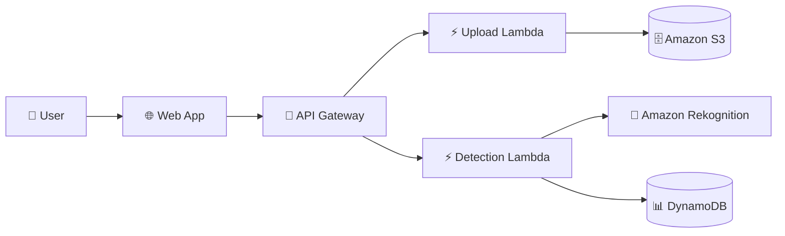

# 🔍 CelebVision-AWS

CelebVision-AWS is an AI-powered celebrity recognition application built using AWS cloud services. Users can upload an image and identify recognized celebrities using **Amazon Rekognition**.

## 🌐 Live Demo

👉 **[View CelebVision Live](http://ec2-13-232-140-60.ap-south-1.compute.amazonaws.com)**

## 🚀 Features

* Upload images for celebrity recognition
* AI-powered celebrity detection
* Store images in Amazon S3
* Store recognition results in DynamoDB
* Serverless backend using AWS Lambda

## 🏗️ Architecture



## ☁️ AWS Services Used

* **Amazon EC2** – Hosts the frontend
* **Amazon API Gateway** – Handles API requests
* **AWS Lambda** – Executes backend logic
* **Amazon S3** – Stores uploaded images
* **Amazon Rekognition** – Recognizes celebrities
* **Amazon DynamoDB** – Stores recognition results and history
* **AWS IAM** – Manages secure permissions

## 📁 Project Structure

```text
CelebVision-AWS/
│
├── index.html
├── css/
│   └── style.css
├── js/
│   └── script.js
│
└── backend/
    ├── upload/
    │   └── lambda_function.py
    └── celebrity_detection/
        └── lambda_function.py
```


## 🎯 Project Objective

A practical demonstration of integrating **AI-powered image recognition with AWS serverless services** to build a scalable celebrity detection application.

## 👨‍💻 Author

**Janhavi Patil**
